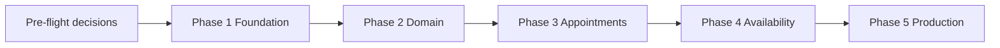

# Execution Plan

## Provider Appointment Platform (appointment-rpc)

| Field | Value |
|-------|--------|
| Document version | 1.0 |
| Date | 2026-05-16 |
| Status | Draft |
| Based on | [sds.md](./sds.md) v2.0 |
| Product vision | [thoughts.md](./thoughts.md) |

---

## Table of contents

1. [Overview](#1-overview)
2. [Pre-flight decisions](#2-pre-flight-decisions)
3. [Phase 1 — Foundation](#3-phase-1--foundation)
4. [Phase 2 — Domain and persistence](#4-phase-2--domain-and-persistence)
5. [Phase 3 — Core appointment APIs](#5-phase-3--core-appointment-apis)
6. [Phase 4 — Availability and quality](#6-phase-4--availability-and-quality)
7. [Phase 5 — Production readiness](#7-phase-5--production-readiness)
8. [Cross-cutting work](#8-cross-cutting-work)
9. [Milestones and definition of done](#9-milestones-and-definition-of-done)
10. [Risks and dependencies](#10-risks-and-dependencies)
11. [Document history](#11-document-history)

---

## 1. Overview

### 1.1 Objective

Implement the **appointment-rpc** service described in the SDS: a multi-tenant appointment scheduling backend for healthcare and other tenants, exposed primarily via **gRPC**, backed by **PostgreSQL**, and built on **Java 25** and **Spring Boot 4.x**.

### 1.2 Current state

| Item | Status |
|------|--------|
| SDS | Complete (draft) |
| Application code | Not started |
| Database | Not provisioned |
| CI/CD | Not configured |

### 1.3 Delivery map (SDS §11)

| Phase | SDS deliverable | Execution plan section |
|-------|-----------------|------------------------|
| 1 | Spring Boot skeleton, PostgreSQL, Liquibase, `GetProvider` gRPC | [§3](#3-phase-1--foundation) |
| 2 | `Tenant`, `Provider`, `Appointment` entities + repositories | [§4](#4-phase-2--domain-and-persistence) |
| 3 | `BookAppointment`, `CancelAppointment`, tenant metadata interceptor | [§5](#5-phase-3--core-appointment-apis) |
| 4 | Availability rules, conflict detection, Testcontainers tests | [§6](#4-phase-4--availability-and-quality) |
| 5 | TLS, auth interceptor, Docker/K8s, observability | [§7](#5-phase-5--production-readiness) |

### 1.4 Recommended sequence

Phases are **sequential**. Do not start Phase 3 until Phase 2 acceptance criteria pass.

---

## 2. Pre-flight decisions

Resolve before Phase 1 coding. Track outcomes in this table.

| ID | Topic (SDS §12) | Options | Decision | Owner | Due |
|----|-----------------|---------|----------|-------|-----|
| O-1 | gRPC framework | `grpc-spring-boot-starter` vs plain `grpc-java` | _TBD_ | — | Before Phase 1 |
| O-2 | Repo / module name | `appointment-rpc` (current) | _TBD_ | — | Before Phase 1 |
| O-3 | Patient identity | Opaque `patient_ref` only (MVP) vs external registry | _Recommend: opaque ref for MVP_ | — | Before Phase 3 |
| O-4 | Row Level Security | App-level `tenant_id` filter only vs PostgreSQL RLS | _Recommend: app-level for MVP_ | — | Before Phase 4 |

**Additional decisions (not in SDS open issues)**

| Topic | Recommendation | Rationale |
|-------|----------------|-----------|
| Build tool | **Gradle** (Kotlin DSL) | Matches SDS §3.1; align runbook in SDS §10.3 with Gradle |
| Package root | `com.pratyabhi` | Matches SDS module layout |
| Migration tool path | `src/main/resources/db/changelog/` | Liquibase convention (not Flyway-style `migration/`) |
| Dev database | Docker Compose PostgreSQL 17 | Matches SDS stack |

---

## 3. Phase 1 — Foundation

**Goal:** Runnable Spring Boot service with database connectivity, schema versioning, and one working gRPC RPC.

**Estimated effort:** 3–5 days

### 3.1 Tasks

- [ ] **1.1** Initialize Gradle project (Java 25 toolchain, Spring Boot 4.x BOM).
- [ ] **1.2** Add dependencies: Spring Data JPA, PostgreSQL driver, Liquibase, Actuator, gRPC + protobuf (per O-1).
- [ ] **1.3** Configure `protobuf` Gradle plugin; set `src/main/proto` as proto source set.
- [ ] **1.4** Create `appointment.proto` with `appointment.v1.AppointmentService` and `GetProvider` RPC (minimal messages).
- [ ] **1.5** Implement `AppointmentRpcApplication` and package structure per SDS §4.2.
- [ ] **1.6** Add `application.yml`: datasource, Liquibase, gRPC port **9090**, Actuator on **8080**.
- [ ] **1.7** Add `docker-compose.yml` with PostgreSQL 17 and documented credentials for local dev.
- [ ] **1.8** Add Liquibase master changelog; create `provider` table stub (id, tenant_id, display_name, specialty).
- [ ] **1.9** Implement `Provider` JPA entity and `ProviderRepository`.
- [ ] **1.10** Implement `ProviderService.get(tenantId, providerId)`.
- [ ] **1.11** Implement `AppointmentGrpcService` with `GetProvider` delegating to `ProviderService`.
- [ ] **1.12** Seed one tenant + one provider via Liquibase data changelog (dev only).
- [ ] **1.13** Update `README.md` with Gradle run instructions (`docker compose up`, `./gradlew bootRun`).
- [ ] **1.14** Manual smoke test with `grpcurl` (plaintext, `x-tenant-id` header).

### 3.2 Deliverables

| Artifact | Location |
|----------|----------|
| Gradle build | `build.gradle.kts`, `settings.gradle.kts` |
| Proto contract | `src/main/proto/appointment/v1/appointment.proto` |
| gRPC service | `src/main/java/.../grpc/AppointmentGrpcService.java` |
| Local infra | `docker-compose.yml` |
| Schema | `src/main/resources/db/changelog/` |

### 3.3 Acceptance criteria

- [ ] `./gradlew bootRun` starts without errors; Liquibase applies changelogs.
- [ ] `GET http://localhost:8080/actuator/health` returns `UP`.
- [ ] `grpcurl` `GetProvider` returns seeded provider for valid `x-tenant-id`.
- [ ] Unknown tenant or provider returns gRPC `NOT_FOUND`.

---

## 4. Phase 2 — Domain and persistence

**Goal:** Full entity model, tenant scoping, and repository layer ready for appointment use cases.

**Estimated effort:** 4–6 days  
**Depends on:** Phase 1 complete

### 4.1 Tasks

- [ ] **2.1** Liquibase changelogs: `tenant`, `provider` (finalize), `appointment`, `availability`.
- [ ] **2.2** JPA entities: `Tenant`, `Provider`, `Appointment`, `Availability` per SDS §6.1.
- [ ] **2.3** Enums: `TenantType` (`HEALTHCARE`, `GENERIC`), `AppointmentStatus` (e.g. `BOOKED`, `CANCELLED`).
- [ ] **2.4** Unique constraint on `(tenant_id, provider_id, start_time)` for appointments.
- [ ] **2.5** Spring Data repositories with tenant-scoped query methods.
- [ ] **2.6** Implement `TenantContext` (thread-local or gRPC `Context` propagation).
- [ ] **2.7** Implement `TenantMetadataInterceptor`: read `x-tenant-id`, validate UUID, set `TenantContext`, clear on completion.
- [ ] **2.8** Register interceptor on gRPC server.
- [ ] **2.9** Implement `TenantService` and `ProviderService.listByTenant(tenantId)`.
- [ ] **2.10** Extend proto: `Tenant`, `Provider`, `Appointment` messages; add `GetAppointment` RPC stub (implementation in Phase 3).
- [ ] **2.11** Unit tests for repositories (Testcontainers PostgreSQL).

### 4.2 Deliverables

| Artifact | Description |
|----------|-------------|
| Schema v1 | All four tables with FKs and indexes |
| `TenantContext` + interceptor | Tenancy enforced on every gRPC call |
| Repository test suite | CRUD and tenant isolation verified |

### 4.3 Acceptance criteria

- [ ] Queries never return rows from another tenant (repository + integration tests).
- [ ] Missing or invalid `x-tenant-id` returns `INVALID_ARGUMENT` before business logic runs.
- [ ] Seed data includes at least two tenants to prove isolation.

---

## 5. Phase 3 — Core appointment APIs

**Goal:** Book, cancel, and retrieve appointments through gRPC with transactional integrity.

**Estimated effort:** 5–7 days  
**Depends on:** Phase 2 complete

### 5.1 Tasks

- [ ] **3.1** Extend proto: `BookAppointment`, `CancelAppointment`, `GetAppointment` (SDS §5.1).
- [ ] **3.2** Implement `AppointmentService`:
  - [ ] `book(tenantId, providerId, patientRef, startTime, durationMinutes)`
  - [ ] `cancel(tenantId, appointmentId)`
  - [ ] `findById(tenantId, appointmentId)`
- [ ] **3.3** Basic conflict check: reject overlapping appointments for same provider (same tenant).
- [ ] **3.4** `@Transactional` boundaries on mutating service methods.
- [ ] **3.5** Wire RPCs in `AppointmentGrpcService`; map request/response to domain DTOs.
- [ ] **3.6** Domain exceptions: `TenantNotFoundException`, `ProviderNotFoundException`, `SlotUnavailableException`, `InvalidArgumentException`.
- [ ] **3.7** `GrpcExceptionAdvice` mapping to gRPC status + `ErrorInfo` (SDS §5.3).
- [ ] **3.8** Integration tests: happy-path book; cancel; double-book returns `FAILED_PRECONDITION`; cross-tenant access denied.
- [ ] **3.9** Optional: simple Java gRPC sample client under `src/test` or `tools/` for manual testing.

### 5.2 Deliverables

| RPC | Behavior |
|-----|----------|
| `BookAppointment` | Persists appointment; returns id + status |
| `CancelAppointment` | Sets status cancelled; idempotent if already cancelled |
| `GetAppointment` | Returns appointment or `NOT_FOUND` |

### 5.3 Acceptance criteria

- [ ] End-to-end book → get → cancel flow passes integration tests.
- [ ] `tenant_id` in metadata must match any `tenant_id` in request body (reject mismatch).
- [ ] Double booking same slot fails with `SLOT_UNAVAILABLE` / `FAILED_PRECONDITION`.
- [ ] All error codes in SDS §5.3 are covered by at least one test.

---

## 6. Phase 4 — Availability and quality

**Goal:** Working hours, availability listing, robust conflict rules, and automated test coverage.

**Estimated effort:** 5–7 days  
**Depends on:** Phase 3 complete

### 6.1 Tasks

- [ ] **4.1** Implement `AvailabilityService`: define weekly hours per provider; support exceptions (future-friendly model).
- [ ] **4.2** Implement `ListAvailability` gRPC RPC (date range → available slots).
- [ ] **4.3** Enhance `AppointmentService.book`: reject slots outside availability windows.
- [ ] **4.4** Optimistic locking: `@Version` on `Appointment` for concurrent reschedule (if reschedule added).
- [ ] **4.5** Optional: `RescheduleAppointment` RPC (stretch; document if deferred).
- [ ] **4.6** Testcontainers suite: full book flow with availability boundaries.
- [ ] **4.7** Performance smoke: book latency under 500 ms locally (informal; not load test).
- [ ] **4.8** Resolve O-4: document tenant filter approach; add RLS backlog item if deferred.

### 6.2 Deliverables

| Item | Description |
|------|-------------|
| `ListAvailability` | Returns slots respecting provider hours |
| Conflict rules | No book outside hours; no overlap |
| Integration test suite | Runnable via `./gradlew test` |

### 6.3 Acceptance criteria

- [ ] Booking outside availability returns `SLOT_UNAVAILABLE`.
- [ ] `ListAvailability` returns only free slots within defined hours.
- [ ] `./gradlew test` passes in CI with Testcontainers (Docker available).
- [ ] Test coverage ≥ 70% on service layer (team target).

---

## 7. Phase 5 — Production readiness

**Goal:** Secure, observable, containerized deployment suitable for staging/production.

**Estimated effort:** 5–8 days  
**Depends on:** Phase 4 complete

### 7.1 Tasks

- [ ] **5.1** Dockerfile (multi-stage, `eclipse-temurin:25-jre` or LTS JRE per ops standard).
- [ ] **5.2** gRPC **TLS** configuration; document dev (plaintext) vs prod (TLS) in README.
- [ ] **5.3** Auth gRPC interceptor: validate API key or JWT; populate tenant from claim if applicable.
- [ ] **5.4** Structured JSON logging (tenant_id, trace_id in MDC).
- [ ] **5.5** Micrometer metrics: RPC count, latency histogram, error rate; expose `/actuator/prometheus`.
- [ ] **5.6** OpenTelemetry tracing (optional exporter config via env).
- [ ] **5.7** Kubernetes manifests: Deployment, Service (gRPC), ConfigMap, Secret references.
- [ ] **5.8** CI pipeline: build, test (with Docker), publish image.
- [ ] **5.9** Environment config: externalize DB URL, TLS certs, secrets (no credentials in repo).
- [ ] **5.10** Runbook: deploy, rollback, health checks, common failures.
- [ ] **5.11** HA notes: ≥2 replicas, connection pool sizing per instance (SDS §9).

### 7.2 Deliverables

| Artifact | Description |
|----------|-------------|
| `Dockerfile` | Production image build |
| `k8s/` or `deploy/` | Deployment manifests |
| `.github/workflows/ci.yml` (or equivalent) | Automated build and test |
| Ops runbook | `docs/runbook.md` (optional) |

### 7.3 Acceptance criteria

- [ ] Image runs in Docker with TLS-enabled gRPC against staging PostgreSQL.
- [ ] Unauthenticated call rejected when auth enabled.
- [ ] Prometheus scrapes metrics; health probe succeeds on `/actuator/health`.
- [ ] CI green on main branch for build + integration tests.

---

## 8. Cross-cutting work

Apply throughout all phases.

| Area | Actions |
|------|---------|
| **Code quality** | Checkstyle or Spotless; no wildcard imports; consistent package layout per SDS |
| **Configuration** | `application.yml` + `application-dev.yml`; secrets via env vars |
| **Documentation** | Keep README, SDS, and execution plan in sync when ports or commands change |
| **Proto versioning** | Package `appointment.v1`; additive changes only until v2 |
| **Logging** | Never log `patient_ref` at INFO in production without policy review |
| **Git** | Feature branches per phase; PR review before merge to main |

---

## 9. Milestones and definition of done

### 9.1 Milestones

| Milestone | Phases | User-visible outcome |
|-----------|--------|----------------------|
| **M1 — Hello gRPC** | 1 | Look up a provider by id |
| **M2 — Data platform** | 2 | Multi-tenant schema live |
| **M3 — MVP bookings** | 3 | Book and cancel appointments via gRPC |
| **M4 — Scheduling** | 4 | List availability; enforce calendar rules |
| **M5 — Ship ready** | 5 | Docker + CI + TLS + metrics |

### 9.2 MVP definition of done (M3)

Minimum product aligned with [thoughts.md](./thoughts.md):

- [ ] Multi-tenant appointment **book** and **cancel**
- [ ] Healthcare and generic tenant types supported in schema
- [ ] gRPC API-to-API integration with `x-tenant-id`
- [ ] PostgreSQL persistence with Liquibase migrations
- [ ] Automated integration tests for core flows

**Explicitly out of MVP:** UI, billing, EHR, full auth gateway, RLS, reschedule (unless pulled into Phase 4).

---

## 10. Risks and dependencies

| Risk | Impact | Mitigation |
|------|--------|------------|
| Spring Boot 4 / Java 25 maturity | Build or API breakage | Pin BOM versions; spike in Phase 1 |
| gRPC + Spring integration choice (O-1) | Rework if wrong | Decide in pre-flight; prototype in 1.11 |
| SDS runbook says Maven, stack says Gradle | Confusion | Standardize on Gradle; update SDS §10 |
| Testcontainers in CI without Docker | Tests fail | Require Docker in CI or use dedicated job |
| Tenant leak via query bug | Security | Mandatory tenant filter tests in Phase 2 |
| Scope creep (reschedule, RLS, gateway) | Delay MVP | Defer to post-M5 backlog |

### 10.1 External dependencies

- JDK 25 installed locally and in CI
- Docker Desktop (or equivalent) for PostgreSQL and Testcontainers
- Container registry and K8s cluster (Phase 5 only)

---

## 11. Document history

| Version | Date | Changes |
|---------|------|---------|
| 1.0 | 2026-05-16 | Initial execution plan from SDS v2.0 |
