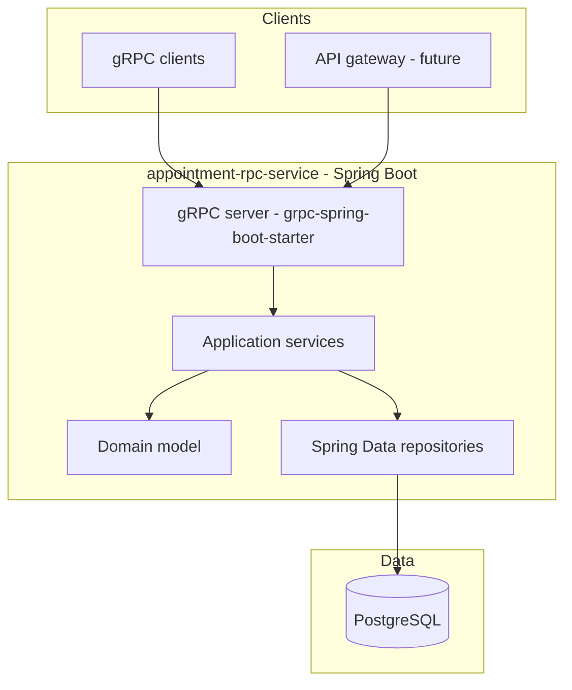
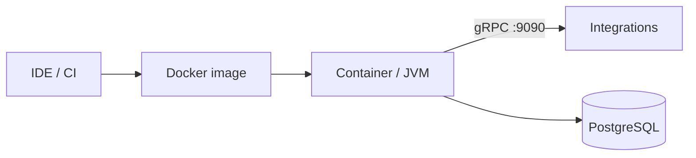
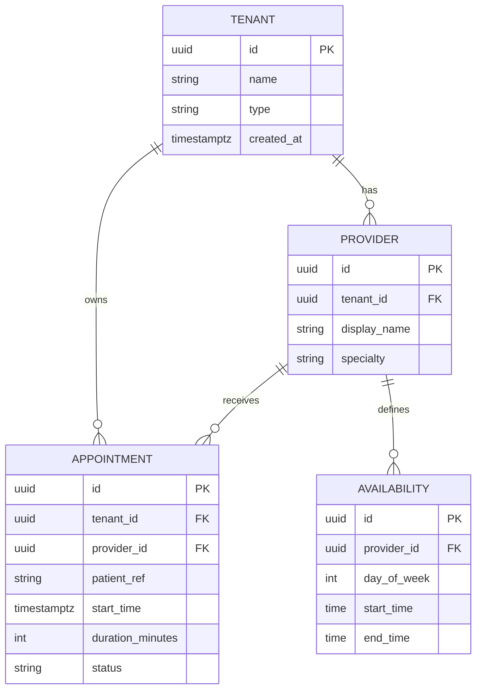
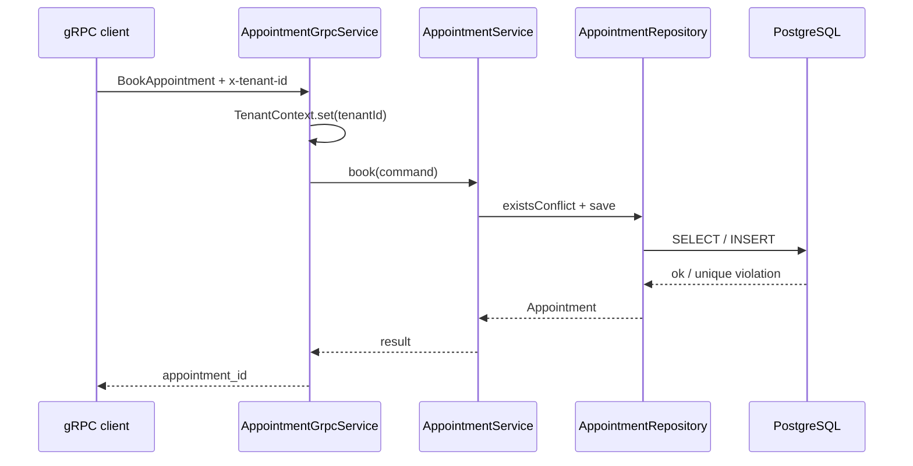

# Software Design Specification (SDS)

## Provider Appointment Platform (appointment-rpc)

| Field | Value |
|-------|--------|
| Document version | 2.0 |
| Date | 2026-05-16 |
| Status | Draft |
| Product | Multi-tenant appointment scheduling |
| Runtime | Java 25, Spring Boot 4.x, gRPC |

---

## Table of contents

1. [Introduction](#1-introduction)
   - [1.1 Purpose](#11-purpose)
   - [1.2 Scope](#12-scope)
   - [1.3 Definitions](#13-definitions)
   - [1.4 References](#14-references)
   - [1.5 Business line](#15-business-line)
2. [System overview](#2-system-overview)
   - [2.1 Problem statement](#21-problem-statement)
   - [2.2 Goals](#22-goals)
   - [2.3 System state](#23-system-state)
3. [Architecture](#3-architecture)
   - [3.1 Technology stack](#31-technology-stack)
   - [3.2 Logical architecture](#32-logical-architecture)
   - [3.3 Layering](#33-layering)
   - [3.4 Deployment view](#34-deployment-view)
4. [Component design](#4-component-design)
   - [4.1 Components](#41-components)
   - [4.2 Module layout](#42-module-layout)
5. [Interface design](#5-interface-design)
   - [5.1 gRPC API (primary)](#51-grpc-api-primary)
   - [5.2 Application services (internal)](#52-application-services-internal)
   - [5.3 Error model](#53-error-model)
6. [Data design](#6-data-design)
   - [6.1 Conceptual model](#61-conceptual-model)
   - [6.2 Tenant types](#62-tenant-types)
   - [6.3 Multi-tenancy](#63-multi-tenancy)
   - [6.4 Persistence](#64-persistence)
7. [Key flows](#7-key-flows)
   - [7.1 Book appointment](#71-book-appointment)
   - [7.2 Local development](#72-local-development)
8. [Security](#8-security)
9. [Non-functional requirements](#9-non-functional-requirements)
10. [Build and deployment](#10-build-and-deployment)
    - [10.1 Repository layout (target)](#101-repository-layout-target)
    - [10.2 Key dependencies (Maven)](#102-key-dependencies-maven)
    - [10.3 Runbook (development)](#103-runbook-development)
    - [10.4 Production deployment](#104-production-deployment)
11. [Migration roadmap](#11-migration-roadmap)
12. [Open issues](#12-open-issues)
13. [Document history](#13-document-history)

---

## 1. Introduction

### 1.1 Purpose

This Software Design Specification describes the architecture, components, interfaces, and deployment model for the **Provider Appointment** application—a container-friendly, multi-tenant appointment platform.

### 1.2 Scope

**In scope**

- Server-side appointment and provider domain logic
- Tenant isolation (healthcare providers and other tenant types)
- **gRPC** for service-to-service integration
- **Spring Boot** application services (transactional use cases)
- **PostgreSQL** persistence via Spring Data JPA
- Remote clients and API consumers

**Out of scope (initial release)**

- End-user web or mobile UI (consumers integrate via APIs)
- Billing, insurance claims, and clinical records (EHR)
- Identity provider implementation (assumed external or pluggable)

### 1.3 Definitions

| Term | Definition |
|------|------------|
| Tenant | An organization using the platform (e.g. clinic, practice, non-healthcare business) |
| Provider | A schedulable resource within a tenant (e.g. doctor, room, consultant) |
| Appointment | A booked time slot between a patient/customer and a provider |
| SDS | Software Design Specification |
| gRPC | Google Remote Procedure Call; contract-first APIs via Protocol Buffers |

### 1.4 References

- `docs/thoughts.md` — product vision and business line
- `README.md` — local run instructions
- [Spring Boot](https://spring.io/projects/spring-boot), [gRPC Java](https://grpc.io/docs/languages/java/), [Protocol Buffers](https://protobuf.dev/)

### 1.5 Business line

*Multi-tenant appointment scheduling for healthcare providers and other organizations, with gRPC for reliable service-to-service integration.*

---

## 2. System overview

### 2.1 Problem statement

Organizations need a shared platform to manage appointments across multiple tenants, with each tenant owning its providers, calendars, and booking rules. Integrations with other systems (scheduling portals, CRM, hospital systems) require stable, language-neutral APIs.

### 2.2 Goals

1. Support **multi-tenancy** with clear data and configuration boundaries per tenant.
2. Model **appointments** (create, reschedule, cancel, list availability).
3. Expose **gRPC** as the primary integration API.
4. Implement business logic with **Spring `@Service`** beans and declarative **`@Transactional`**.
5. Deploy as a **standalone JAR** (embedded Tomcat optional for Actuator/health only) or **Docker** image—no application server.

### 2.3 System state

| Aspect | Design |
|--------|--------|
| Runtime | Spring Boot 4.x executable JAR |
| API | gRPC (:9090) |
| Client | gRPC client (any language) |
| Domain | Appointments, providers, tenants |
| Tenancy | Tenant-scoped data and configuration |
| Persistence | PostgreSQL + Liquibase migrations |
| Build | Maven or Gradle |

---

## 3. Architecture

### 3.1 Technology stack

| Concern | Choice | Notes |
|---------|--------|--------|
| Language | Java 25 | Aligns with current JDK direction |
| Framework | Spring Boot 4.x | DI, config, Actuator, testing |
| API | gRPC + protobuf | Primary integration surface |
| Persistence | Spring Data JPA, Hibernate | Entities + repositories |
| Database | PostgreSQL 17+ | Tenant-scoped relational data |
| Migrations | Liquibase | Versioned schema in `src/main/resources/db/migration` |
| Build | Gradle | `protobuf-maven-plugin` for codegen |
| Observability | Micrometer, OpenTelemetry | Metrics and distributed tracing |
| Packaging | Docker | Multi-stage build; no JBoss/WildFly |

### 3.2 Logical architecture



### 3.3 Layering

| Layer | Responsibility | Spring artifacts |
|-------|----------------|------------------|
| **API** | gRPC service implementations, validation, tenant metadata | `@GrpcService` |
| **Application** | Use cases: book, cancel, reschedule, availability | `@Service`, `@Transactional` |
| **Domain** | Entities, value objects, domain exceptions | JPA entities, records |
| **Infrastructure** | DB access, clocks, IDs | `@Repository` interfaces |

### 3.4 Deployment view



- **Process**: Single Spring Boot process; gRPC on port **9090** (configurable).
- **Health**: Spring Boot Actuator HTTP on **8080** (`/actuator/health`) for orchestrators only—not a public REST API for domain operations.
- **Database**: Managed PostgreSQL instance; credentials via environment or secrets manager.

---

## 4. Component design

### 4.1 Components

| Component | Type | Description |
|-----------|------|-------------|
| `AppointmentGrpcService` | gRPC | Maps RPCs to application services |
| `TenantService` | `@Service` | Tenant metadata; resolve tenant from gRPC metadata |
| `ProviderService` | `@Service` | Manage providers per tenant |
| `AppointmentService` | `@Service` | Book, cancel, reschedule; enforce conflicts |
| `AvailabilityService` | `@Service` | Working hours and exceptions |
| `TenantRepository` | Spring Data | `JpaRepository<Tenant, UUID>` |
| `ProviderRepository` | Spring Data | Tenant-scoped queries |
| `AppointmentRepository` | Spring Data | Conflict checks, listings |
| `TenantContext` | Thread-local / gRPC `Context` | Propagates `tenant_id` per request |

### 4.2 Module layout

```
appointment-rpc/
├── pom.xml
├── Dockerfile
├── docker-compose.yml          # app + postgres for local dev
├── src/main/java/com/zazzercode/
│   ├── AppointmentRpcApplication.java
│   ├── grpc/                   # @GrpcService implementations
│   ├── service/                # @Service use cases
│   ├── domain/                 # JPA entities
│   ├── repository/             # Spring Data interfaces
│   └── config/                 # Security, gRPC, tenancy filters
├── src/main/proto/
│   └── appointment/v1/appointment.proto
├── src/main/resources/
│   ├── application.yml
│   └── db/migration/           # Liquibase SQL
└── src/test/java/              # @SpringBootTest, Testcontainers
```

---

## 5. Interface design

### 5.1 gRPC API (primary)

**Service**: `appointment.v1.AppointmentService`

| RPC | Request | Response |
|-----|---------|----------|
| `BookAppointment` | tenant_id, provider_id, patient_ref, start_time, duration_minutes | appointment_id, status |
| `CancelAppointment` | tenant_id, appointment_id | empty |
| `GetAppointment` | tenant_id, appointment_id | Appointment message |
| `ListAvailability` | tenant_id, provider_id, date_range | repeated TimeSlot |
| `GetProvider` | tenant_id, provider_id | Provider message |

**Metadata (required on every call)**

| Key | Description |
|-----|-------------|
| `x-tenant-id` | Tenant UUID (or API gateway injects from JWT) |
| `authorization` | Bearer token or API key (future) |

**Proto location**: `src/main/proto/appointment/v1/appointment.proto`

**Example generated stub usage (Java client)**

```java
ManagedChannel channel = ManagedChannelBuilder.forAddress("localhost", 9090)
    .usePlaintext() // dev only; TLS in production
    .build();
AppointmentServiceGrpc.AppointmentServiceBlockingStub stub =
    AppointmentServiceGrpc.newBlockingStub(channel);
Metadata headers = new Metadata();
headers.put(Metadata.Key.of("x-tenant-id", ASCII_STRING_MARSHALLER), tenantId);
stub.withInterceptors(MetadataUtils.newAttachHeadersInterceptor(headers))
    .getProvider(GetProviderRequest.newBuilder().setProviderId(id).build());
```

### 5.2 Application services (internal)

Not exposed over the network; invoked by gRPC adapters only.

| Service | Operations (illustrative) |
|---------|---------------------------|
| `AppointmentService` | `book(...)`, `cancel(id)`, `reschedule(id, slot)`, `findById(id)` |
| `ProviderService` | `listByTenant(tenantId)`, `get(tenantId, id)` |
| `TenantService` | `get(tenantId)`, `register(...)` (admin) |

Mutating methods use `@Transactional` on the service class or method. Optimistic locking via `@Version` on `Appointment` where needed.

### 5.3 Error model

| Domain code | gRPC status | Meaning |
|-------------|-------------|---------|
| `TENANT_NOT_FOUND` | `NOT_FOUND` | Unknown tenant |
| `PROVIDER_NOT_FOUND` | `NOT_FOUND` | Provider not in tenant |
| `SLOT_UNAVAILABLE` | `FAILED_PRECONDITION` | Double booking or outside hours |
| `INVALID_ARGUMENT` | `INVALID_ARGUMENT` | Validation failure |

`GrpcExceptionAdvice` (or per-service handler) maps `DomainException` subclasses to `io.grpc.Status` with `google.rpc.ErrorInfo` details.

---

## 6. Data design

### 6.1 Conceptual model



### 6.2 Tenant types

| `tenant.type` | Example use |
|---------------|-------------|
| `HEALTHCARE` | Clinics, hospitals |
| `GENERIC` | Salons, consultants, other schedulable businesses |

### 6.3 Multi-tenancy

- Every repository query filters by **`tenant_id`** from `TenantContext`.
- Unique constraints scoped per tenant: `(tenant_id, provider_id, start_time)` for conflict detection.
- Consider PostgreSQL **Row Level Security (RLS)** in a later phase for defense in depth.

### 6.4 Persistence

- **ORM**: Jakarta Persistence latest via Hibernate latest.
- **Migrations**: Liquibase; no `hbm2ddl.auto=update` in production.
- **IDs**: UUID v4 for all external references.
- **Connection pool**: HikariCP (Spring Boot default).

---

## 7. Key flows

### 7.1 Book appointment



### 7.2 Local development

1. `docker compose up -d` — starts PostgreSQL (and optionally the app).
2. `mvn spring-boot:run` — Liquibase migrates schema; gRPC listens on **9090**.
3. Run sample client or `grpcurl` against `ListAvailability` / `GetProvider`.

---

## 8. Security

| Concern | Approach |
|---------|----------|
| Authentication | API keys or JWT validated in gRPC server interceptor |
| Authorization | `tenant_id` in metadata must match payload; reject on mismatch |
| Transport | **TLS** on gRPC in all non-dev environments (mTLS optional between services) |
| Secrets | Environment variables / vault; never commit credentials |
| Data | Encrypt `patient_ref` at rest if policy requires; PostgreSQL TDE optional |

---

## 9. Non-functional requirements

| Attribute | Target |
|-----------|--------|
| Availability | 99.9% with ≥2 app replicas behind load balancer |
| Latency | gRPC P95 &lt; 200 ms read; &lt; 500 ms book |
| Scalability | Horizontally scale stateless Spring Boot instances; DB connection limits per instance |
| Observability | JSON logs; Micrometer → Prometheus; trace propagation via OpenTelemetry |
| Compatibility | Java 21 LTS; pin gRPC and protobuf versions in BOM |

---

## 10. Build and deployment

### 10.1 Repository layout (target)

```
appointment-rpc/                   # repo name; service module may rename later
├── src/                          # Spring Boot application
├── docs/
│   ├── thoughts.md
│   └── sds.md
├── Dockerfile
├── docker-compose.yml
└── pom.xml
```

### 10.2 Key dependencies (Maven)

- `spring-boot-starter-data-jpa`
- `grpc-spring-boot-starter` (or `grpc-netty-shaded` + manual wiring)
- `protobuf-java`, `grpc-stub`, `grpc-protobuf`
- `postgresql`, `liquibase-core`
- `spring-boot-starter-actuator`
- Test: `spring-boot-starter-test`, `testcontainers-postgresql`

### 10.3 Runbook (development)

```bash
docker compose up -d postgres
mvn clean spring-boot:run
# gRPC: localhost:9090
# Health: http://localhost:8080/actuator/health
```

### 10.4 Production deployment

- Build: `mvn -DskipTests package` → executable JAR.
- Image: multi-stage Dockerfile (`eclipse-temurin:21-jre`).
- Orchestration: Kubernetes Deployment + Service (gRPC port); external Secrets for DB URL and TLS certs.

---

## 11. Migration roadmap

| Phase | Deliverable |
|-------|-------------|
| **1** | Spring Boot skeleton, PostgreSQL, liquibase, `GetProvider` gRPC |
| **2** | `Tenant`, `Provider`, `Appointment` entities + repositories |
| **3** | `BookAppointment`, `CancelAppointment`, tenant metadata interceptor |
| **4** | Availability rules, conflict detection, Testcontainers integration tests |
| **5** | TLS, auth interceptor, Docker/K8s manifests, observability |

---

## 12. Open issues

| ID | Topic | Decision needed |
|----|--------|-----------------|
| O-1 | gRPC framework | `grpc-spring-boot-starter` vs plain `grpc-java` |
| O-2 | Module rename | Keep `appointment-rpc` repo name |
| O-3 | Patient identity | Opaque `patient_ref` only vs external patient registry |
| O-4 | Row Level Security | Application-only tenant filter vs PostgreSQL RLS |

---

## 13. Document history

| Version | Date | Changes |
|---------|------|---------|
| 1.0 | 2026-05-16 | Spring Boot 4, gRPC, PostgreSQL, Docker |
